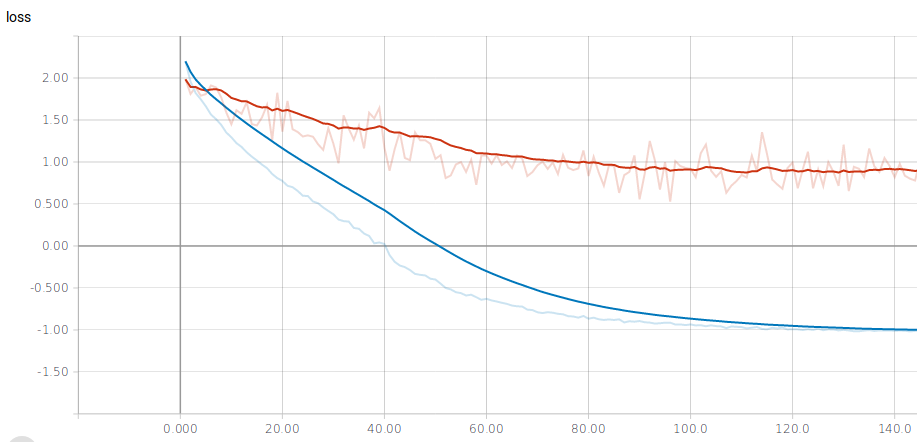
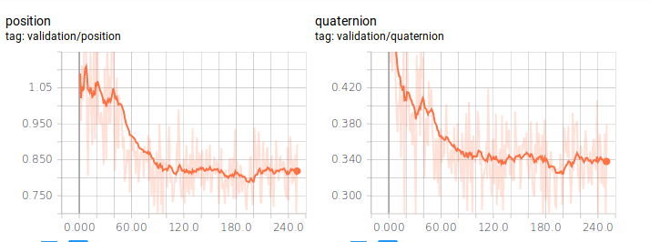
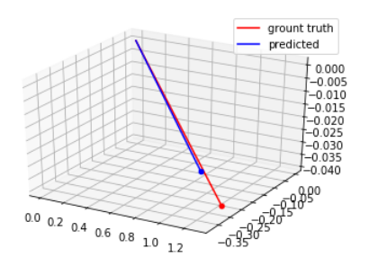

# PoseNet
Simple realization of PoseNet model for camera localization task

## Installation:
  There are simple rest-api based on Flask framework.

  Firstly, build docker container:
  `nvidia-docker build -t posenet .`

  Run container with `5000` port for compatibility with test script:
  `nvidia-docker run -p 5000:5000 posenet`

### Perfomance testing:
  It was not possible to perform many experiments, so weights provided just for example.

  Use onboard [test script](inference/test_inference.py):
  (need [requests lib](https://github.com/kennethreitz/requests))
  
  `python inference/test_inference.py /path/to/imagefile.png`
  
  Or simple cURL command:
  
  `curl -X POST -F "image=@/path/to/imagefile.png" http://127.0.0.1:5000/predict`
  
### Training environment:
  To reproduce training environment use conda:

  `conda env create -f environment.yml`

  Set hyperparameters as variables in [train config file](src/train_config.py)
  
  ## Training process and results:
   As mentioned earlier, it's just example, not production-ready project, so there are some big error values.

   Dataset divided into train validation, and test parts.
   
   Model was training on random crops from original images for 250 epoches with batch size = 4 and LR decaying.

   Loss: weighted sum of pairwise distance between position and quaternion pairs (with learnable weights as parameters)
   
  
   Core augmentaions: Random brightness and contrast and noise for reproduction of day-night cases
  
   TTA: Final prediction is mean of n random crops.
   
   Using separate parts of loss for perfomance metric:
   
   
   All logs available in tensorboard events : [log folder](logs/)
      
   In [visualization notebook](posenet_visualize.ipynb) you can predict images and look and compare with ground truth vectors:
   
